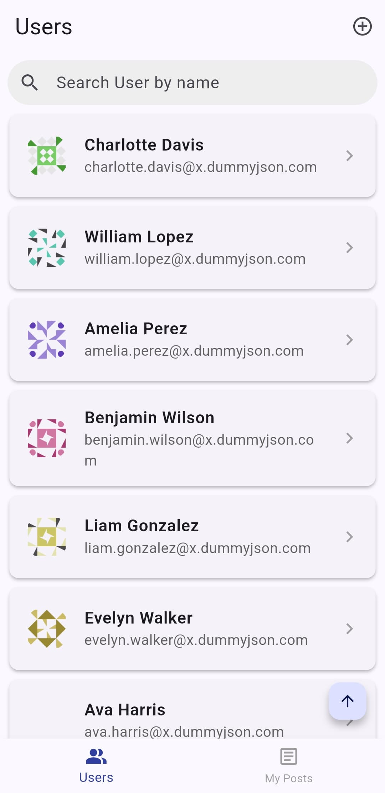
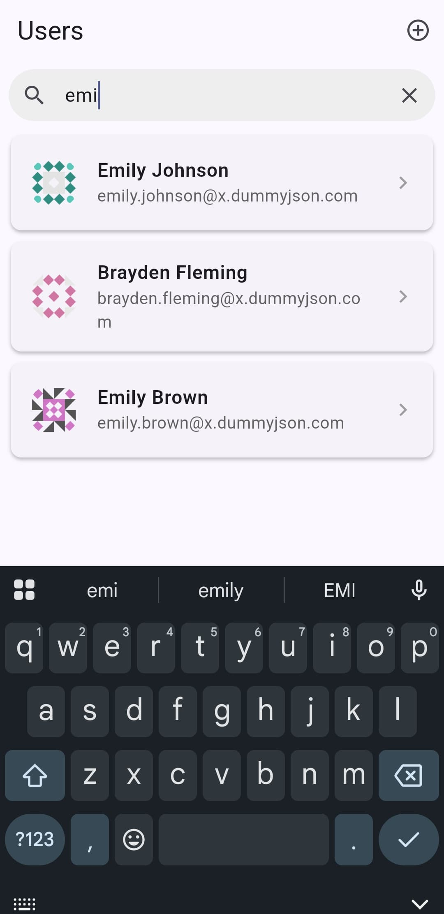
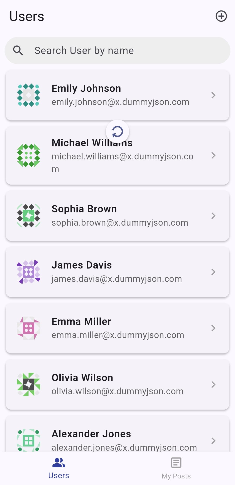
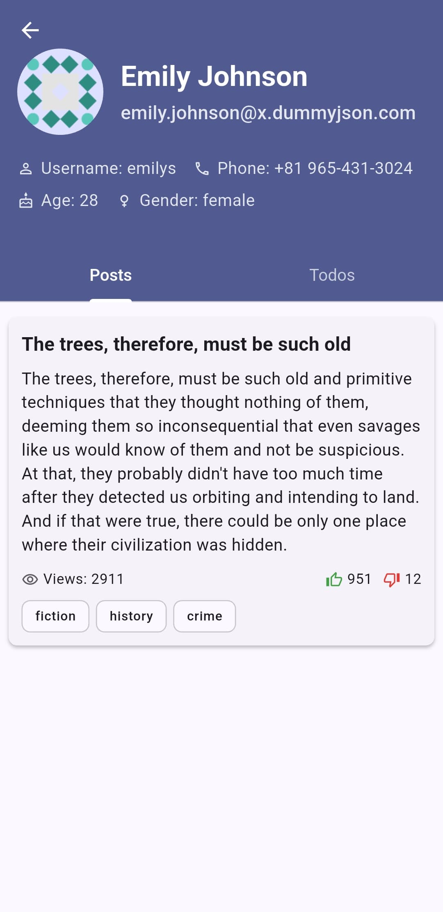
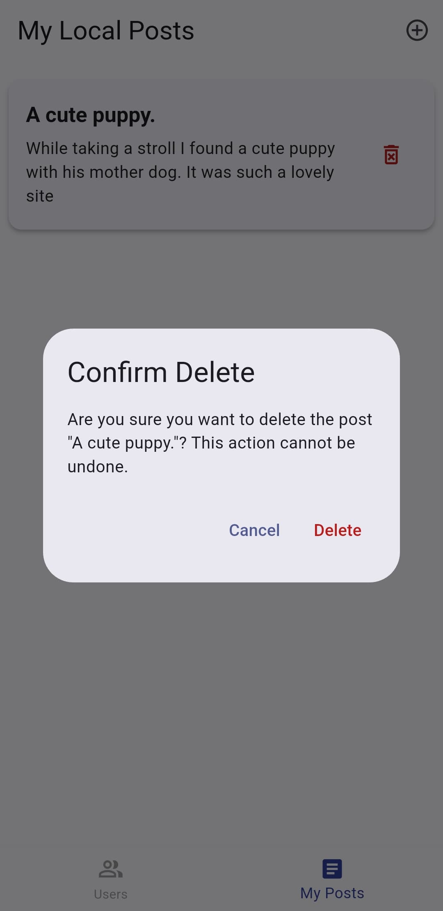
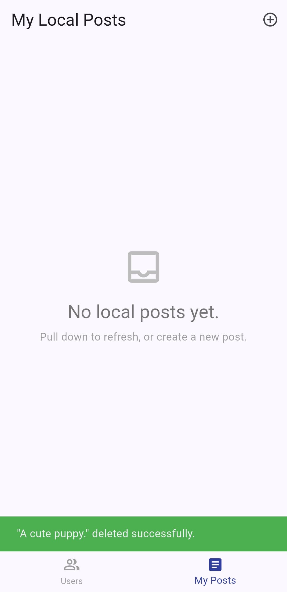
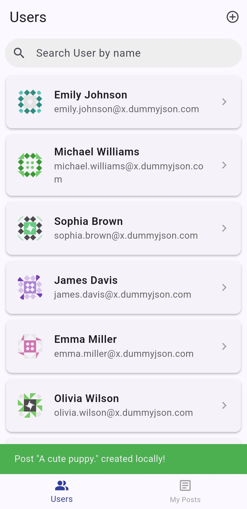

# User Management & Local Posts - Flutter BLoC Assessment

A Flutter application demonstrating robust state management using the BLoC pattern. It interacts with the [DummyJSON API](https://dummyjson.com) to fetch and manage user data, supports local post creation with persistence, and features a clean, responsive UI.

Built as part of a Flutter assessment to showcase architectural best practices, clean code organization, and effective use of Flutter's modern toolset.

---

## 📸 Screenshots

### 🧑 User List  
_Demonstrates user listing, infinite scroll, search, and pull-to-refresh functionality._

  
  


---

### 👤 User Details  
_Shows user-specific information with posts and todos in separate tabs, featuring a collapsing header._

  


---

### 📝 Local Post Creation & Management  
_Functionality for creating, viewing, and deleting locally persisted posts._


  
  
  


---

## 🚀 Features

### ✅ Core Features

- **User Management (DummyJSON API):**
  - Fetches and displays paginated user data.
  - Infinite scrolling with limit/skip logic.
  - Real-time search by user name.
  - Pull-to-refresh support.

- **User Details Screen:**
  - View user information.
  - Fetch and show user-specific posts.
  - Fetch and show user-specific todos.
  - Collapsing user profile header with pinned tabs for Posts and Todos.
  - Pull-to-refresh enabled.

- **Local Post Management:**
  - Create new posts (title & body).
  - Store posts locally using `shared_preferences`.
  - Displayed in a dedicated 'My Posts' tab via Bottom Navigation.
  - Delete with confirmation.
  - Pull-to-refresh support.

- **State Management (BLoC):**
  - `flutter_bloc` + `equatable` for scalable logic separation.
  - Distinct BLoCs for each major feature.
  - Clean loading/error/success state handling.

- **UI/UX:**
  - Bottom navigation bar.
  - Responsive layout with loading indicators.
  - Clear error states and retry mechanisms.
  - Scroll-to-top FAB on long user lists.
  - User avatars with loading indicators and error placeholder icons.

### 🌟 Bonus Features

- **Offline Persistence for Local Posts**
- **Pull-to-Refresh Across Screens**
- *(Planned)* Theme switch toggle
- *(Planned)* UI animations for transitions

---

## 🧰 Tech Stack & Packages

- **Flutter** `3.29.2`
- **Dart** `3.7.2`
- **Packages:**
  - `flutter_bloc` – BLoC architecture
  - `equatable` – Value equality in states/events
  - `http` – REST API integration
  - `shared_preferences` – Local data storage
  - `flutter_dotenv` – For managing environment variables (e.g., API base URL)
  - `bloc_concurrency` – Efficient bloc event handling
  - `stream_transform` – Event stream utilities
---

## 🏗️ Architecture

### 📦 BLoC Structure

- `UserListBloc` – Handles user fetching, search, pagination.
- `UserDetailsBloc` – Fetches selected user data, posts, todos.
- `CreatePostBloc` – Validates and saves new posts locally.
- `LocalPostsBloc` – Loads, deletes, and displays stored posts.

Each BLoC:
- Listens to domain-specific events.
- Talks to repositories/services.
- Emits states (e.g., loading, loaded, error) to update the UI reactively.

### 📁 Folder Structure

lib/
├── application.dart        # Root widget containing MaterialApp and global providers.
├── global_provider.dart    # Sets up Global RepositoryProviders/BlocProviders.
├── main.dart               # Main entry point of the application, initializes services.
│
├── core/                   # Shared code, utilities, and base functionalities.
│   ├── service/            # Shared services.
│   │   ├── user_service.dart      # Handles API calls to DummyJSON.
│   │   └── local_post_repository.dart # Manages persistence of local posts.
│   └── env_service.dart      # Manages environment configurations like baseUrl.
│
└── modules/                # Feature-specific modules.
    ├── create_post/
    │   ├── bloc/           # CreatePostBloc, events, states.
    │   ├── model/          # LocalPostModel (specific to created posts).
    │   └── view/           # CreatePostScreen/View UI.
    │
    ├── local_posts/        # Feature for displaying locally created posts.
    │   ├── bloc/           # LocalPostsBloc, events, states.
    │   └── view/           # LocalPostsScreen/View UI.
    │
    ├── user_details/
    │   ├── bloc/           # UserDetailsBloc, events, states.
    │   ├── model/          # (Potentially empty if API models are in core/models)
    │   │   ├── post_models/  # For API posts
    │   │   └── todo_models/  # For API todos
    │   └── view/           # UserDetailsScreen/View and its specific widgets.
    │       └── widget/     # (e.g., UserInfoHeaderWidget, UserPostsTabWidget)
    │
    ├── user_list/
    │   ├── bloc/           # UserListBloc, events, states.
    │   ├── model/          # (Potentially empty if API User model is in core/models)
    │   │   └── user_model.dart # User model for API data.
    │   └── view/           # UserListScreen/View and related widgets.


- **Modular by Feature:** Each module has its own `bloc/`, `model/`, `view/`.
- **Core Layer:** Contains shared services and configuration logic.

### 🌐 API Integration

- Centralized in `UserService`.
- Endpoints include:
  - `GET /users` with pagination
  - `GET /users/:id/posts`
  - `GET /users/:id/todos`
- Uses `http` for data fetching and Dart models for JSON parsing.

### 💾 Local Persistence

- `LocalPostRepository` uses `shared_preferences` to:
  - Save posts as JSON.
  - Deserialize into `LocalPostModel` on load.
  - Handle deletion and list updates.

### 🧭 Navigation

- Standard `Navigator` and `MaterialPageRoute` for screen transitions.
- `BottomNavigationBar` in `UserListView` manages tab switching between "Users" and "My Posts".

---

## ⚙️ Setup Instructions

### ✅ Prerequisites

- Flutter SDK `3.29.2`+
- Dart SDK `3.7.2`+
- IDE: VS Code or Android Studio with Flutter plugins

### 📥 Installation

- Before running the app, ensure you have the Flutter SDK installed and set up on your machine. Follow the official [Flutter installation guide](https://flutter.dev/docs/get-started/install) if needed.
- Before running,check that you have followed the steps to create the `.env` file as described below.

```bash
git clone https://github.com/AmeyPacharkar1896/flutter_user_bloc_assessment.git
cd flutter_user_bloc_assessment
flutter pub get
flutter run
```

## 🌍 Environment Configuration (Important!)

This project uses a `.env` file to manage the base URL for the API.

### 🛠️ Create a `.env` File

In the root directory of the project, create a file named `.env`.

### 🔧 Add the API Base URL

Add the following line to your `.env` file:

```env
BASE_URL=https://dummyjson.com
```
### 📦 Ensure `.env` is Declared in `pubspec.yaml`
The .env file needs to be declared in your pubspec.yaml under flutter -> assets: for flutter_dotenv to load it:

```yaml
flutter:
  assets:
    - .env
    # - assets/images/  # (other assets, if any)
```


## ⚠️ Challenges Faced

### Sliver + TabBar Overlap

- Implementing a collapsible `SliverAppBar` with tabs was challenging.
- `TabBar` and the scrollable content were overlapping, and the collapse effect wasn’t working as expected.
- Solution:
  - Used `NestedScrollView` with `SliverOverlapAbsorber` and `SliverOverlapInjector`.
  - Moved `TabBar` to the `SliverAppBar.bottom` section.
  - Maintained consistent scroll behavior across tabs.

---

## 🔮 Future Improvements

- Add **theme switching** (light/dark mode)
- Introduce **animations** for smoother UI transitions
- Support **editing** of local posts
- Add **unit & widget tests**
- Use **Isar** or **Hive** for robust offline data persistence

---

## 🙌 Author

**Amey Pacharkar**  
Flutter Developer  
[GitHub](https://github.com/AmeyPacharkar1896) • [LinkedIn](https://linkedin.com/in/amey-pacharkar-28520b307) 

---

## 📄 License

This project is licensed for educational and demonstration purposes.

---
